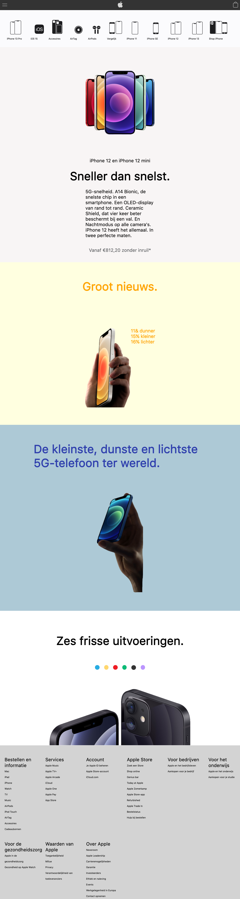
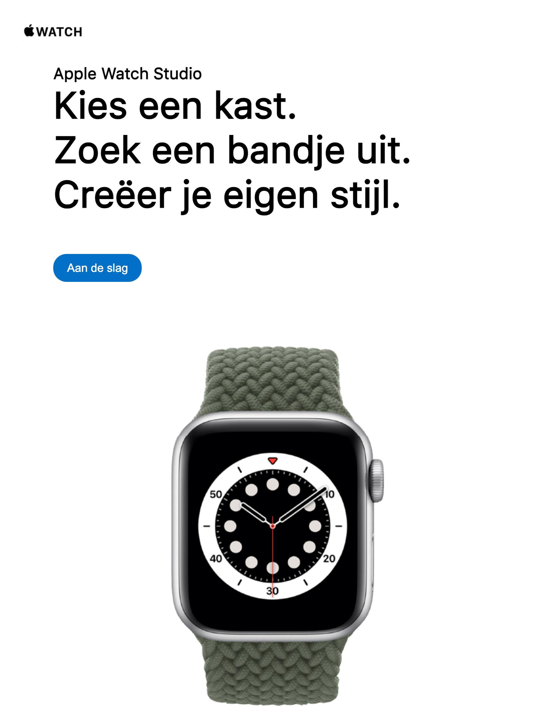
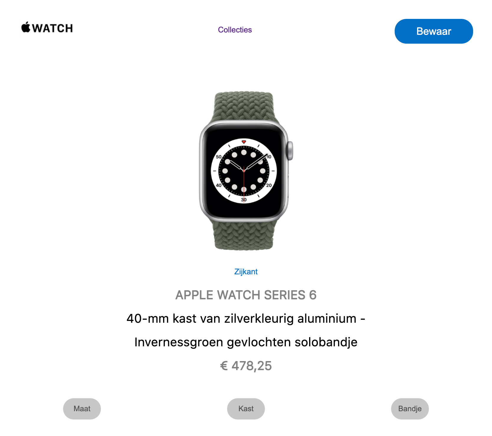

# Procesverslag
Markdown is een simpele manier om HTML te schrijven.  
Markdown cheat cheet: [Hulp bij het schrijven van Markdown](https://github.com/adam-p/markdown-here/wiki/Markdown-Cheatsheet).

Nb. De standaardstructuur en de spartaanse opmaak van de README.md zijn helemaal prima. Het gaat om de inhoud van je procesverslag. Besteedt de tijd voor pracht en praal aan je website.

Nb. Door *open* toe te voegen aan een *details* element kun je deze standaard open zetten. Fijn om dat steeds voor de relevante stuk(ken) te doen.

## Jij

Merel Wiersma

### Auteur:
Merel Wiersma

#### Je startniveau:
Blauw

#### Je focus:
ik begin met responsive en misschien wat animaties als ik daar aan toe kom :)
 UPDATE: volgensmij heb ik op dit moment een beetje van alles wat...
 

## Je website

Apple

### Je opdracht:
https://www.apple.com/nl/iphone-12/?afid=p238%7CsSPtEdyDb-dc_mtid_187079nc38483_pcrid_487299093080_pgrid_114373001947_&cid=aos-nl-kwgo-iphone--slid---product-
 
 https://www.apple.com/shop/studio/apple-watch

#### Screenshot(s) van de eerste pagina (small screen): 

 
Apple iPhone 12

 

 

#### Screenshot(s) van de tweede pagina (small screen):
 
Apple Watch
 

 
  

## Breakdownschets (week 1)

In de schets is te zien hoe de pagina opgedeeld is en welke delen ik zelf ga namaken.

### de hele pagina: 

### dynamisch deel (bijv menu): 

### wellicht nog een dynamisch deel (bijv filter): 

## Voortgang 1 (week 2)

uitwerken voor 1e voortgang

### Stand van zaken
ik heb de lessen best wel kunnen volgen tot nu toe, maar het lijkt me wel ingewikkeld om het van mijzelf zo 'uit mijn hoofd' te moeten doen.
 Ook heb ik deze week niet zo veel tijd gehad om te werken aan school, dus denk ik dat ik met het bouwen van de website iets achterloop.
 
 ik heb ik mijn code in de comments gezet waar ik tegenaanloop en wat ik graag wil veranderen

### Agenda voor meeting
samen met je groepje opstellen

| student 1      | student 2          | student 3    | student 4        |
| ---            | ---                | ---          | ---              |
| dit bespreken  | en dit             | en ik dit    | en dan ik dat    |
| en dat ook nog | dit als er tijd is | nog een punt | dit wil ik zeker |
| ...            | ...                | ...          | ...              |

### Verslag van meeting
in de meeting hebben we een voor een vragen gesteld aan Yunus en Rowin, en werd het opgelost met hun dmv scherm delen etc.
 zelf had ik wat kleine dingetjes zoals de header-icoontjes, een nettere opmaak van mijn html en wat margins weggehaald.
 nu wil ik alleen nog de kopjes onder de icoontjes in de 'belowheader' gecentreerd hebben,
 en een carrousel (of 'keuzemenu') voor de verschillende kleuren iphones onder aan de pagina.
 
 ** ik kwam ik na de feedback achter toen ik verder aan het werk ging:
 bij de transition (in de eerste sectie met de grote afbeelding in het midden) wil ik dat alleen de afbeelding beweegt, en niet de content eronder
naar onder schuift. dus dat het op zn plek blijft.
daarnaast wil ik dat als er niet meer gehoverd wordt, dat de afbeelding langzaam teruggaat naar 
het eerste formaat, en niet plots terugschiet

## Voortgang 2 (week 3)

uitwerken voor 2e voortgang

### Stand van zaken
ik had nog geen tijd gehad om goed verder te gaan aan mijn website

### Agenda voor meeting
samen met je groepje opstellen

| student 1      | student 2          | student 3    | student 4        |
| ---            | ---                | ---          | ---              |
| dit bespreken  | en dit             | en ik dit    | en dan ik dat    |
| en dat ook nog | dit als er tijd is | nog een punt | dit wil ik zeker |
| ...            | ...                | ...          | ...              |

### Verslag van meeting
hier na afloop snel de uitkomsten van de meeting vastleggen

ik heb samen met het groepje een hamburgermenu gemaakt en meteen aan mijn eigen site toegevoegd, ook heb ik gezien hoe je een carrousel maakt en heb daar de code van overgenomen, mocht ik het ooit een keer nodig hebben.
 
 ik ben na het weekend aan mijn site gaan werken en heb wat dingen toegevoegd met javascript, zoals kleurkeuzes.(hier heb ik een tijdje mee lopen kloten maar het is me uiteindelijk wel gelukt in me eentje, waar ik erg blij mee ben), ook heb ik overal comment bijgezet die uitleggen wat mijn code doet en heb ik al mijn codes netjes 'opgeruimd' en geordend, zodat het er weer overzichtelijk uitziet.
 
 er zijn alleen nog wat puntjes zoals de font-family, centreren etc. wat nog wat beter kunnen (zie comments in mijn codes), maar voor nu ga ik denk ik beginnen met de 2e pagina die gemaakt moet worden (de apple watch pagina) ook bij deze heb ik besloten wat meer de focussen op javascript

## Toegankelijkheidstest (week 4)

uitwerken na test in 8e voortgang

### Bevindingen
Lijst met je bevindingen die in de test naar voren kwamen:

#### Titel eerste bevinding
Hier korte omschrijving (met indien nodig een afbeelding)

Hier een omschrijving van hoe het opgelost kan worden (met indien nodig een afbeelding)

#### Titel tweede bevinding. 
Hier korte omschrijving (met indien nodig een afbeelding)

Hier een omschrijving van hoe het opgelost kan worden (met indien nodig een afbeelding)

#### Titel volgende bevinding. 
Hier korte omschrijving (met indien nodig een afbeelding)

Hier een omschrijving van hoe het opgelost kan worden (met indien nodig een afbeelding)

#### Titel nog een bevinding. 
Hier korte omschrijving (met indien nodig een afbeelding)

Hier een omschrijving van hoe het opgelost kan worden (met indien nodig een afbeelding)

## Voortgang 3 (week 4)

uitwerken voor 3e voortgang

### Stand van zaken
in de voortgang heeft rowin mij geholpen met de opmaak van de kleurkeuze buttons en het hoveren van afbeeldingen (dat de scale groter wordt)
 hierna ben ik verder gegaan aan de 2e pagina (apple watch)

### Agenda voor meeting
samen met je groepje opstellen

| student 1      | student 2          | student 3    | student 4        |
| ---            | ---                | ---          | ---              |
| dit bespreken  | en dit             | en ik dit    | en dan ik dat    |
| en dat ook nog | dit als er tijd is | nog een punt | dit wil ik zeker |
| ...            | ...                | ...          | ...              |

### Verslag van meeting
hier na afloop snel de uitkomsten van de meeting vastleggen

- punt 1
- punt 2
- nog een punt
- ...

## Eindgesprek (week 5)

uitwerken voor eindgesprek

### Stand van zaken
ik heb uiteindelijk 1 hele pagina en 2 halve extra pagina's gemaakt (zoals het ook op de apple website loopt)
 de iphone 12 pagina zijn er 2 dingetjes die me niet gelukt zijn:
 
 de z-index van het hamburger menu werkt niet meer
 onderaan de footer wilde ik nog wat links hebben maar die kreeg ik niet mooi gepositioneerd, dus heb ik ze maar weggedaan (als comments, dus ze staan er nog wel)
 
 bij de apple watch pagina heb ik een dropdown menu kunnen maken en met javcascript gewerkt
 
 gemiste kansen waar ik niet meer aan toe kwam:
 
 de combinatie van de applewatches meer uitwerken, dus had ik er graag nog een carrousel in gewild, zodat er gescrolld kan worden en je op die manier kan zien welke touchscreen het 'mooiste' past op het bandje die op dat moment gekozen is.
 
 en een ander js ding: dat als je op 'zijkant' klikt, er automatisch opniew 'voorkant' in de plaats komt te staan, zodat je steeds van zijkant en voorkant kan terugklikken
 
 

### Screenshot(s)

 
 

## Bronnenlijst

continu bijhouden terwijl je werkt

Nb. Wees specifiek ('css-tricks' als bron is bijv. niet specifiek genoeg).

1. https://www.apple.com/nl/shop/studio/apple-watch
2. https://www.apple.com/nl/shop/studio/apple-watch
3. https://www.apple.com/nl/iphone-12/specs/
4. https://www.w3schools.com/howto/howto_css_dropdown.asp

